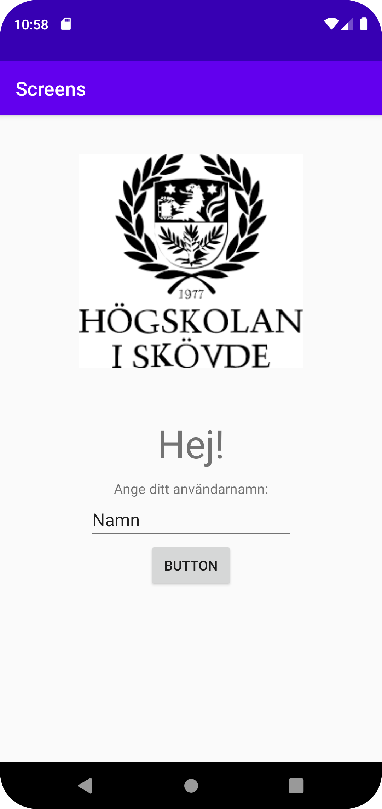
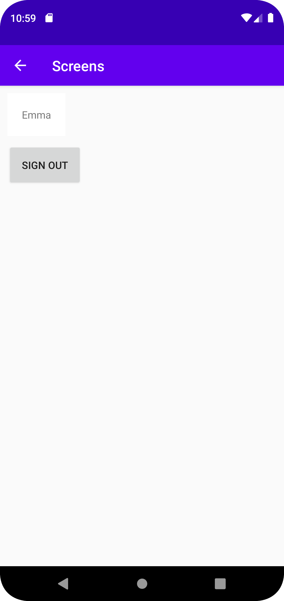

# Rapport

Jag skapade en andra aktivitet genom att lägga till den via menyalternativen File -> New -> Activity -> Empty Activity och namngav till "SecondActivity". 
I den första aktivitetens skärm skapade jag en layout som innehåller en bild, informationstext, ett fält man kan fylla i sitt användarnamn och en knapp som ska starta den andra aktiviteten.
Den andra aktivitetens skärm innehåller ett fält som kan ta emot den text som skrivs i på första skärmen och en "logga ut-knapp" som tar användaren till första aktiviteten.

För inloggnings-knappen sattes en onclicklistner som startar en aktivitet och skickar med extras. 
Figur 1 Kod
```
  public class MainActivity extends AppCompatActivity {
    private Button signin; 
    {...}
    
    @Override
  protected void onCreate(Bundle savedInstanceState) {
      ...
        signin = findViewById(R.id.signin_button);
        signin.setOnClickListener(new View.OnClickListener() {
            @Override
            public void onClick(View view) {
                Log.d("==>", "onclick detected");
                Intent intent = new Intent(MainActivity.this,SecondActivity.class);
                intent.putExtra("username",usernameview.getText().toString());
                Log.d("==>", usernameview.getText().toString());
                startActivity(intent);
            }
        });
    }

```

Här tar jag emot datan och den läggs in i en textview.
Figur 2 Kod
```
     Intent intent = getIntent();
        Bundle extras = intent.getExtras();
        username = findViewById(R.id.profile_layout);
        String name = extras.getString("username");
        username.setText(name);
```





